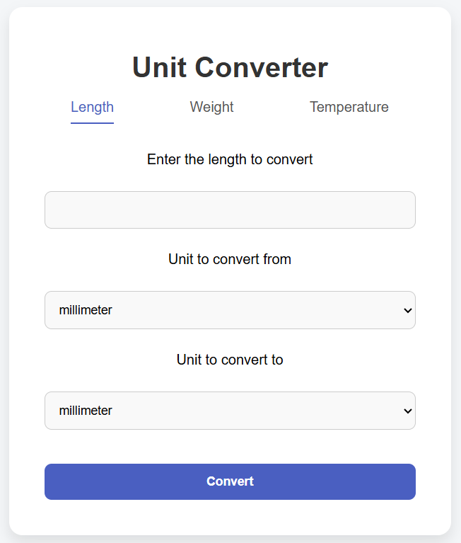

# 🔁 Unit Converter

A simple and user-friendly web application built with React that allows you to convert between different units of **length**, **weight**, and **temperature**.

---

## 🧠 Features

- Convert between multiple units:
  - 📏 Length: millimeters, centimeters, meters, kilometers, inches, feet, yards, miles.
  - ⚖️ Weight: milligrams, grams, kilograms, ounces, pounds.
  - 🌡️ Temperature: Celsius, Fahrenheit, and Kelvin.
- Section-based navigation using `react-router-dom`.
- Real-time input validation and result display.
- Responsive design for mobile and desktop.
- Clean and modern UI.

---

## 🚀 Technologies Used

- ⚛️ [React](https://reactjs.org/)
- 🌐 [React Router DOM](https://reactrouter.com/)
- 🎨 CSS with media queries for responsive layout

---

## 🖼️ Preview

 <!-- Make sure this path points to your actual image -->

---

## 📦 Installation & Usage

1. Clone the repository:
```bash
git clone https://github.com/yourusername/unit-converter.git
cd unit-converter
```
2. Install dependencies:
```bash
npm install
```
3. Start the development server:
```bash
npm run dev
```
4. Open in your browser:
```bash
http://localhost:5173
```

